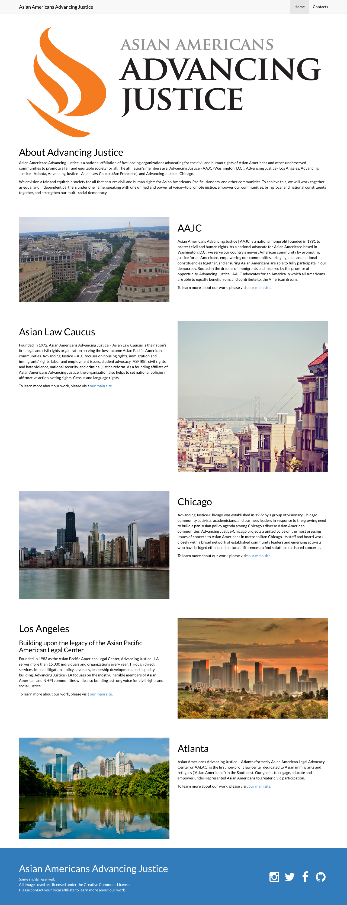
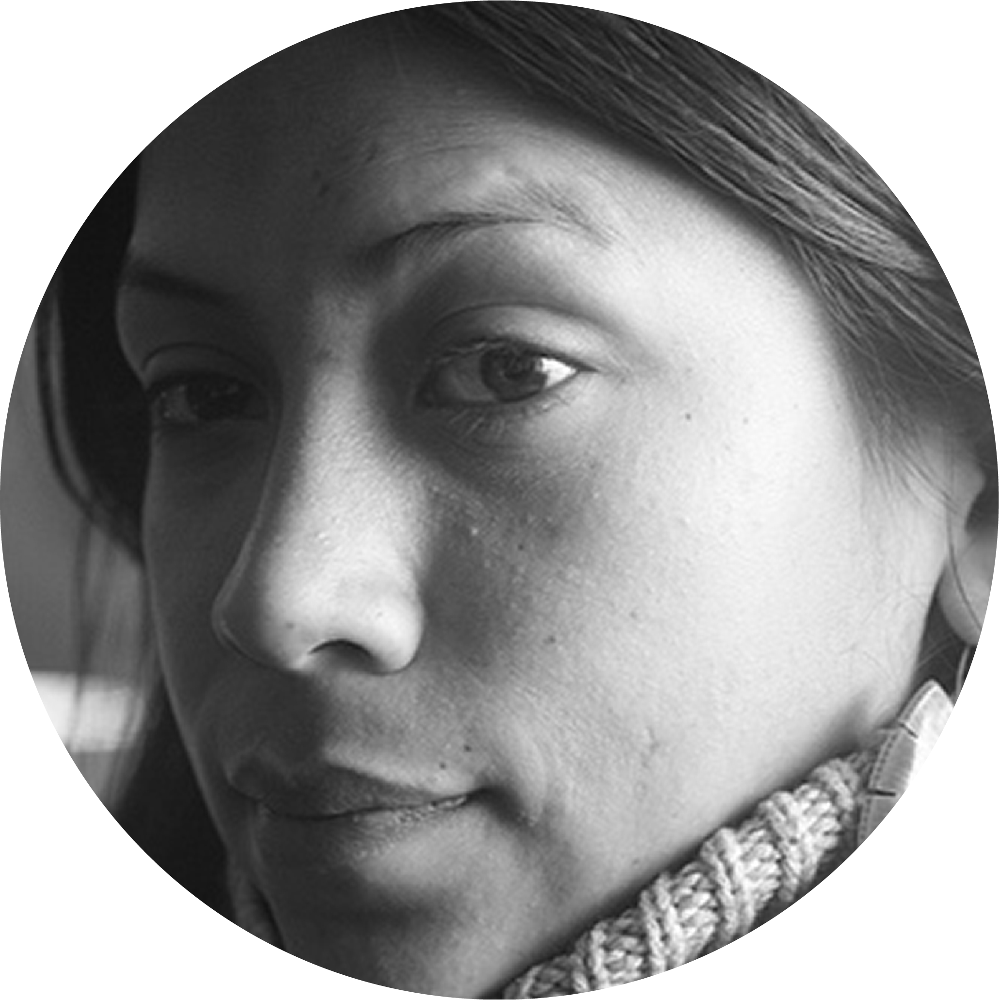

<header>

  # AAPI Equalithon
  

    
  

  ## An Essteem Hackathon
  ### Justice Team
  ##### Daniel Sasse, Aaron Amodt, LaToya Legemah, 
  ##### Natalie Kalaydjian, Claudette Carino

</header>

__Table of Contents__
* [Purpose](#purpose)
  * [Original Webpage](#original)
* [Problem Criteria](#problem-criteria)
* [Solution](#solution)
  * [Proposed Redesign](#proposal)
* [Features](#features)
* [Meet The Team](#meet-the-team)

### Purpose
Advancing Justices’ goal is to convert their current live webpage into a more interactive, user-friendly sitethat speaks to its users and focuses heavily on donations for their nonprofit affiliates.

Sending a clear-cut message to your users as quickly and succinctly as possible, while instilling trust and value is what we wanted to convey in our redesign for this project. 
Having a well-designed landing page that can be used as a marketing tool to convert leads into donations is crucial for the success of many non-profits and can be a highly valuable resource.

The Asian Americans Advancing Justices’ website currently is a static page, with __no donation button__, containing a header paragraph about the organization, __no photos of people__ or accolades and __lengthy__ paragraphs describing their affiliates.

  
  
  <em>Original Webpage</em>

### Problem Criteria

If a user is directed to this website, they don’t feel engaged by the successes or mission of the organization visually and have no option for giving a donation.

With the user goals being defined as __engaging__ users, helping with __donations__ and improving overall site __usability__, we needed to focus on tools to showcase these features.

Educating the audience about who AAJC helps, what they do and why they should donate to their organization was our focus in the redesign.

### Solution

In viewing the current Advancing Justice site, we wanted to make clear our user goals were to focus on these key elements:
1. __DONATIONS:__ we want the users to be able to donate easily through the website portal. We designed  several bold donate buttons throughout the page in intuitive locations
2. __EDUCATE:__ we want to educate the user of what the AAAJ does for the community, why there is a need for their important work and what are their successes. With this in mind, we created infographics, a “what we do” section and a current affairs carousel.
3. __ENGAGE:__ by adding photos of people and positive success stories, the user is feeling the direct contribution the organization is having with the community.

  
  
  <em>Revamped Webpage</em>

### Features

* Large bright orange donate buttons throughout the site, so users won’t miss it. 
* The rotating carousel of “Success Stories” engages users on a personal level showcasing their direct impact in people lives.
* Donors want to know where their donations are going. The “How Advancing Justice Helps” section illustrates that with bold icons and a brief summary so users can visually see and read this info briefly.
* Rotating carousel with bold photos that set the tone and engage the viewer. This is an opportunity to highlight current events, goals, and accomplishments, to show that AAJC is up-to-date and an active contributing organization.
* Eye-catching infographics to illustrate the purpose for the Advancing Justice organization and educate the user about who they are helping
* Multi-outlet sharing functionality to increase the ability for users to promote the page.
* Multi-language support to provide access for all users.

### Meet The Team

    

      <a href="https://github.com/dsasse07">
        
         
        
          <b>Daniel Sasse</b>
           
          Developer
        
      </a>
    

    

      <a href="https://github.com/amodttech">
        
         
        
          <b>Aaron Amodt</b>
           
          Developer
        
      </a>
    

    

      <a href="https://github.com/latoyale">
        
         
        
          <b>LaToya Legemah</b>
           
          Developer
        
      </a>
    

    

      <a href="">
        
         
        
          <b>Natalie Kalaydjian</b> 
           
          UX Designer
        
      </a>
    

    

      <a href="">
        
         
        
          <b>Claudette Carino</b> 
           
          UX Designer
        
      </a>
    

